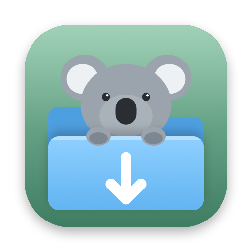

<p align="center">
  
</p>

<h1 align="center">Joey</h1>

<p align="center">
  A small, native BitTorrent client for macOS.<br>
  Your downloads, tucked safely in the pouch. 🐨
</p>

<p align="center">
  <a href="https://github.com/kimiyuch/joey.app/releases/latest/download/Joey.dmg"><b>Download Joey</b></a>
  ·
  <a href="https://joey.kimiyu.ch">Website</a>
</p>

---

## Features

- **Magnet links and .torrent files**: open them from your browser or Finder, or drop them onto the window
- **Choose what to download**: pick individual files from a torrent
- **Download in order**: start watching a video before it has finished
- **Built-in video player** for finished downloads and any other video (File → Open Video…, or Open With in Finder): MKV and most other formats, subtitles, audio tracks, resume where you left off, media keys
- **Seeding limits**: stop seeding at a ratio or after a set time
- **Speed limits** for downloads and uploads
- **Menu bar item** with live speeds; Joey keeps seeding when the window is closed
- **Notifications** when a download finishes
- **Stays awake** while downloading, so your Mac doesn't fall asleep mid-download
- **Automatic updates**
- Remembers everything between launches

## Requirements

- A Mac with Apple Silicon (M1 or newer)
- macOS 26 or newer

## Installing

1. Download [Joey.dmg](https://github.com/kimiyuch/joey.app/releases/latest/download/Joey.dmg) and drag Joey to **Applications**.
2. Open Joey. The first time, macOS will say it can't verify the developer, because Joey isn't notarized by Apple.
3. Open **System Settings → Privacy & Security**, scroll down and click **Open Anyway**.

You only need to do this once. Joey updates itself after that.

## Building from source

You need Xcode and the Apple Silicon version of [Homebrew](https://brew.sh) (in `/opt/homebrew`).

```sh
brew install libtorrent-rasterbar mpv
./build.sh        # builds build/Joey.app
./make-dmg.sh     # builds build/Joey.dmg
```

`build.sh` downloads [Sparkle](https://sparkle-project.org) into `vendor/` the first time, then bundles libtorrent, OpenSSL, mpv (with FFmpeg and its other libraries) and Sparkle into the app, so it runs without Homebrew.

## Releasing

```sh
./release.sh 0.2   # release notes come from CHANGELOG.md
```

This bumps the version, builds the app and DMG, signs the update with the Sparkle key in your Keychain, writes `appcast.xml`, tags the commit and publishes a GitHub release. Joey checks `releases/latest/download/appcast.xml`, so every installed copy sees the new version.

The signing key lives in the macOS Keychain (account `joey`). Export it with `vendor/sparkle-2.10.0/bin/generate_keys --account joey -x sparkle-private-key.txt` (that filename is gitignored) and keep a copy somewhere safe, like a password manager. Without it you can't publish updates to existing installs. To restore it on a new Mac, run `generate_keys --account joey -f sparkle-private-key.txt`.

## How it's built

| Part | |
|---|---|
| `Sources/TorrentCore` | A thin C wrapper around [libtorrent](https://libtorrent.org), which does all the BitTorrent work |
| `Sources/Joey` | The SwiftUI app |
| `scripts/make-icon.swift` | Draws the app icon |

## Credits

Joey is built on [libtorrent](https://libtorrent.org) (BSD), [OpenSSL](https://openssl.org) (Apache 2.0), [mpv](https://mpv.io) with [FFmpeg](https://ffmpeg.org) (GPL) and [Sparkle](https://sparkle-project.org) (MIT). Their licenses ship inside the app under `Contents/Resources/Licenses`.

## License

Joey is free software under the [GNU General Public License v3](LICENSE).
